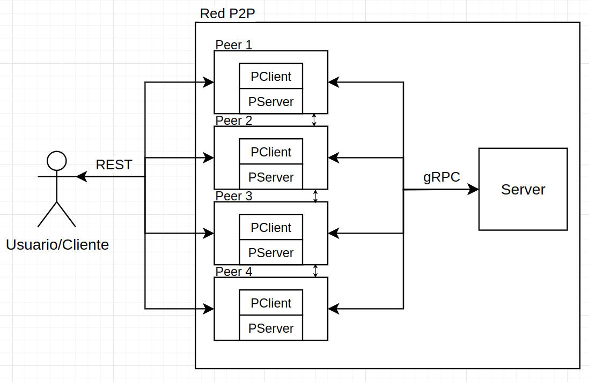
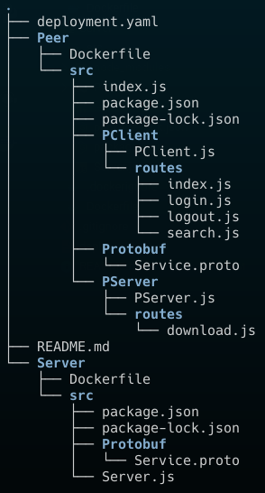

# Información de la materia:

ST0263 - Tópicos de Telemática

# Estudiante:

Nombre: Andrés Julian Caro Restrepo

Correo: ajcaror@eafit.edu.co

# Profesor:

Nombre: Alvaro Enrique Ospina Sanjuan

Correo: aeospinas@eafit.edu.co

# P2P - Comunicación entre procesos mediante API REST, RPC y MOM

# 1. Descripción de la actividad

El proyecto implementa un sistema distribuido para la gestión de archivos. Consta de un servidor principal y un peer compuesto por un PServer y un PClient. El servidor principal se encarga de la gestión de usuarios y archivos, mientras que el peer se encarga de la transferencia de archivos. Se utilizan gRPC y API REST para la comunicación entre los componentes.

# 2. Información general de diseño de alto nivel, arquitectura, patrones, mejores prácticas utilizadas.

El diagrama muestra la arquitectura general del sistema, que se compone de los siguientes elementos:

**Usuario/Cliente:**

-   Interactúa con el sistema a través de una interfaz gráfica o una herramienta como Postman.
-   Se comunica con el servidor principal mediante el protocolo API REST.
-   Realiza peticiones para los métodos:
    -   Login: Iniciar sesión en el sistema.
    -   Logout: Cerrar sesión en el sistema.
    -   Index: Obtener una lista de los archivos disponibles.
    -   Search: Buscar archivos por nombre.
    -   Download: Descargar un archivo.

**Servidor principal:**

- Almacena metadatos de archivos y gestiona la autenticación y autorización de usuarios.
- Se comunica con los Peers mediante gRPC para los métodos:
  - Login: Validar las credenciales del usuario.
  - Logout: Incluir al usuario en la lista de inactivos.
  - Index: Obtener la lista de archivos disponibles en el servidor.
  - Search: Buscar archivos en el servidor por nombre o metadatos.

**Peer:**

- Compuesto por dos módulos:
  - PServer
  - PClient.
- Se encarga de la transferencia de archivos entre Peers.
- Se comunica con el Servidor principal mediante gRPC.

# 3. Descripción del ambiente de desarrollo y técnico: lenguaje de programación, librerias, paquetes, etc, con sus numeros de versiones.

## Servidor principal:

- **Lenguaje de programación:** Node.js v18.15.0
- **Librerías:**
  - @grpc/grpc-js v1.10.1 (para comunicación gRPC)
  - dotenv v16.4.5 (para gestión de variables de entorno)

## Peer:

- **Lenguaje de programación:** Node.js v18.15.0
- **Librerías:**
  - @grpc/grpc-js v1.10.1 (para comunicación gRPC)
  - @grpc/proto-loader v0.7.10 (para carga de archivos Protobuf)
  - dotenv v16.4.5 (para gestión de variables de entorno)
  - express v4.18.3 (para API REST)

## Protocolos:

- **gRPC** para la comunicación entre el servidor principal y los Peers.
- **API REST** para la comunicación entre el PClient y el servidor principal, y para la descarga de archivos entre Peers.

## Tecnologías adicionales:

- **Docker** para la contenerización del sistema.
- **Kubernetes** para la orquestación de los contenedores.

## Estructura de directorio

<!-- ## Muestras -->

# Referencias:

-   [gRPC Node Documentation](https://grpc.io/docs/languages/node/)
-   [What is RPC? gRPC Introduction by ByteByteGo](https://www.youtube.com/watch?v=gnchfOojMk4&ab_channel=ByteByteGo)
-   [Where should you use gRPC? And where NOT to use it!](https://www.youtube.com/watch?v=4SuFtQV8RCk&ab_channel=CodeOpinion)
-   [gRPC Crash Course - Modes, Examples, Pros & Cons and more by Hussein Nasser](https://www.youtube.com/watch?v=Yw4rkaTc0f8&ab_channel=HusseinNasser)
-   [gRPC en NodeJS by Carlos David](https://www.youtube.com/watch?v=5xlwFWakNvA&ab_channel=CarlosDavid)
-   [Creating your gRPC w/ Protobuf Server in Node/Typescript! (Part 1, Intro) by TDot Code](https://www.youtube.com/watch?v=0cxEVcALoxc&t=655s&ab_channel=TDotCode)
-   [Protocol Buffers Documentation](https://protobuf.dev/)
-   [System design primer repository by @donnemartin](https://github.com/donnemartin/system-design-primer?tab=readme-ov-file#remote-procedure-call-rpc)
